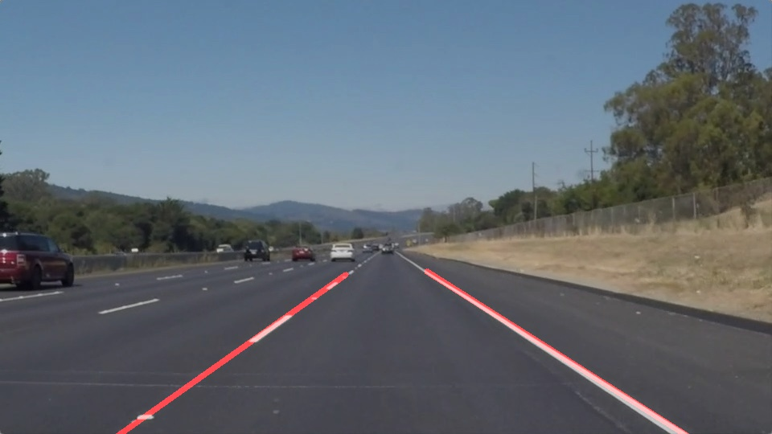
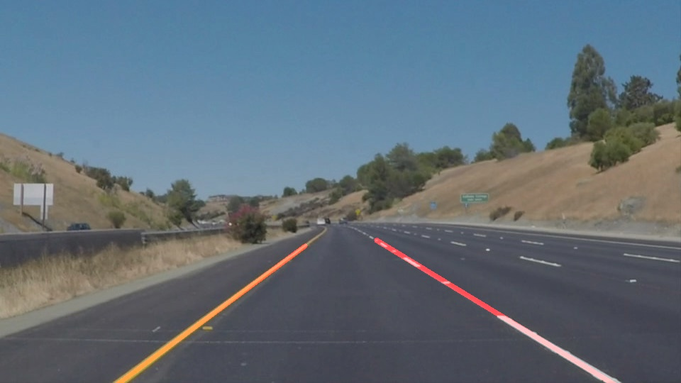

# **Finding Lane Lines on the Road** 

**Lane Detection**

The goals / steps of this project are the following:
* Make a pipeline that finds lane lines on the road
* Reflect on your work in a written report

---

### Reflection

### 1. Pipeline used for lane detection
The pipeline consisted of 8 steps. These steps are listed as below:
#### a. Color selection and thresholding
#### b. Grayscale and Gaussian Smoothing
#### c. Canny edge detection
#### d. Region of Interest Selection
#### e. Line detection, classification and fitting
In order to draw a single line on the left and right lanes, I modified the draw_lines() function by ...
#### f. Final results
The final image looked like:

 
 

### 2. Identify potential shortcomings with your current pipeline

One potential shortcoming would be what would happen when ... 

Another shortcoming could be ...

### 3. Suggest possible improvements to your pipeline

A possible improvement would be to ...

Another potential improvement could be to ...
