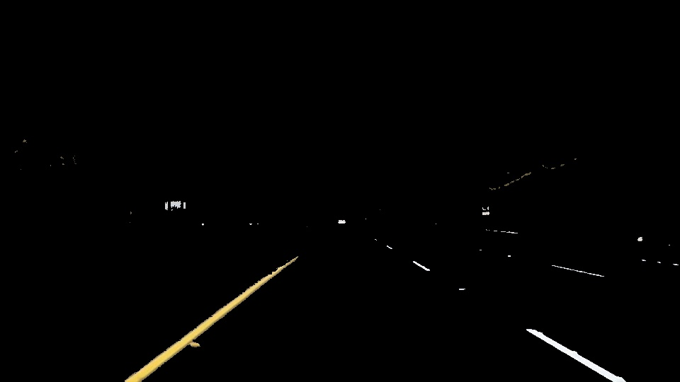
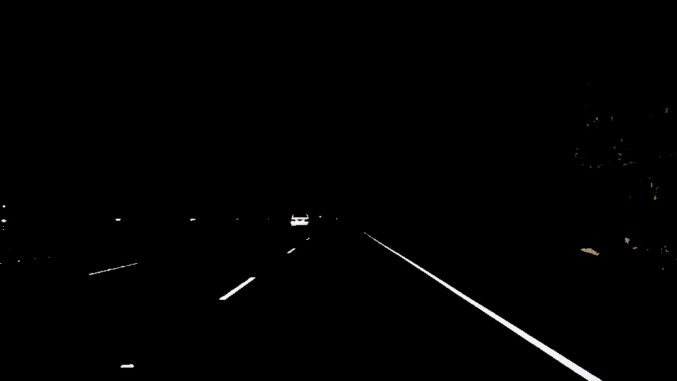
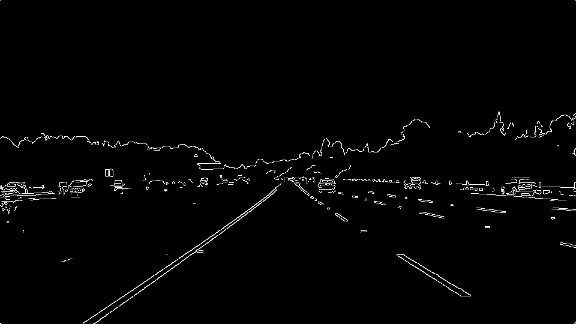
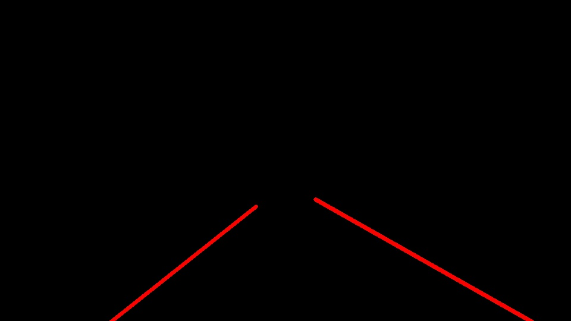

# **Finding Lane Lines on the Road** 

**Lane Detection**

The goals / steps of this project are the following:
* Make a pipeline that finds lane lines on the road
* Reflect on your work in a written report

---

### Reflection

### 1. Pipeline used for lane detection
The pipeline consisted of 8 steps. These steps are listed as below:
#### a. Color selection and thresholding
The first step of the pipeline was filtering out the input image based on a range of colors. A white filter was developed using the RGB color range and a Yellow filter was developed using an HVS scale. The lower threshold for the yellow color was (15,90,20) and the higher threshold was (25, 255, 255). These two filters were combined and colors outside this range were masked as black pixels. The images below show the result of this color selection and thresholding on the images of the road.

 

#### b. Grayscale and Gaussian Smoothing
To further filter the image for a more narrowed lane search. A grayscale filter was applied that converts the image into one color channel. To reduce the noise in the image, a gaussian filter (blur box filter) is then applied with a kernel size of 15. A high kernel size was chosen to prevent aliasing. 

#### c. Canny edge detection
Canny edge detection is used to determine edges by computing gradients on a grayscale, smooth image. Once the gradient magnitude and orientation of the pixels are identified, the algorithm uses a non-maximum suppression technique to discretize the gradient orientation and suppress the values that are not of maximum inorder to look for thin edges. Hysteresis thresholding then helps to identify strong and weak edges. If a weak edge is connected to a strong edge it will be added to the edge otherwise it will be discarded. Caanny edge detection gives single-pixel-wide edges with good continuation between adjacent pixels. 

 

#### d. Region of Interest Selection
Once the edges of the image are obtained, the search space is contained using a trapezoidal (polygon) approach to narrow down the area in which the lanes will be located. This will help us localize the search for the lane lines and reduce interference. 

#### e. Line detection, classification and fitting

In order to draw a single line on the left and right lanes, the draw_lines() function was modified by calculating the slope of the edges to differentiate between the left and right lines. Based on the side, a line of best fit was determined with use of the RANSACRegressor function. This facilitated the removal of any anomalies in the dataset of points, and linear regression was used to map the inliers to the line of best fit. This line was then extrapolated accordingly, for either lane side, and the lanes lines were then drawn.

 

#### f. Final results
The final output image overlays the original image with the lane lines drawn. Example of these are presented below:

 
 

### 2. Identify potential shortcomings with your current pipeline

One potential shortcoming would be what would happen when ... 

Another shortcoming could be ...

### 3. Suggest possible improvements to your pipeline

A possible improvement would be to ...

Another potential improvement could be to ...
